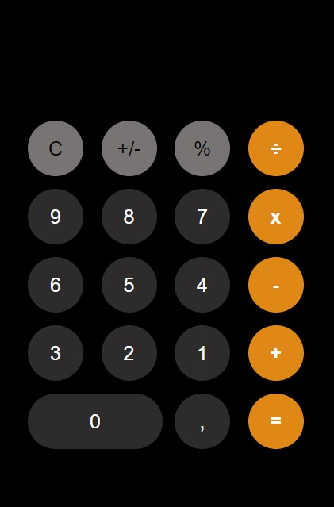

<h1>Calculadora Apple</h1>

Uma recriação da calculadora da Apple, está hospedada no link <a>calculadora-apple.vercel.app</a>.

Com sua lógica é possível fazer operações matemáticas como somar, diminuir, multiplicar, dividir e calcular a porcentagem. Contém outras funcionalidades como limpar o display, negativar um número e a vírgula para calcular números decimais.

 
 

<h2>Pré visualização</h2>
 

